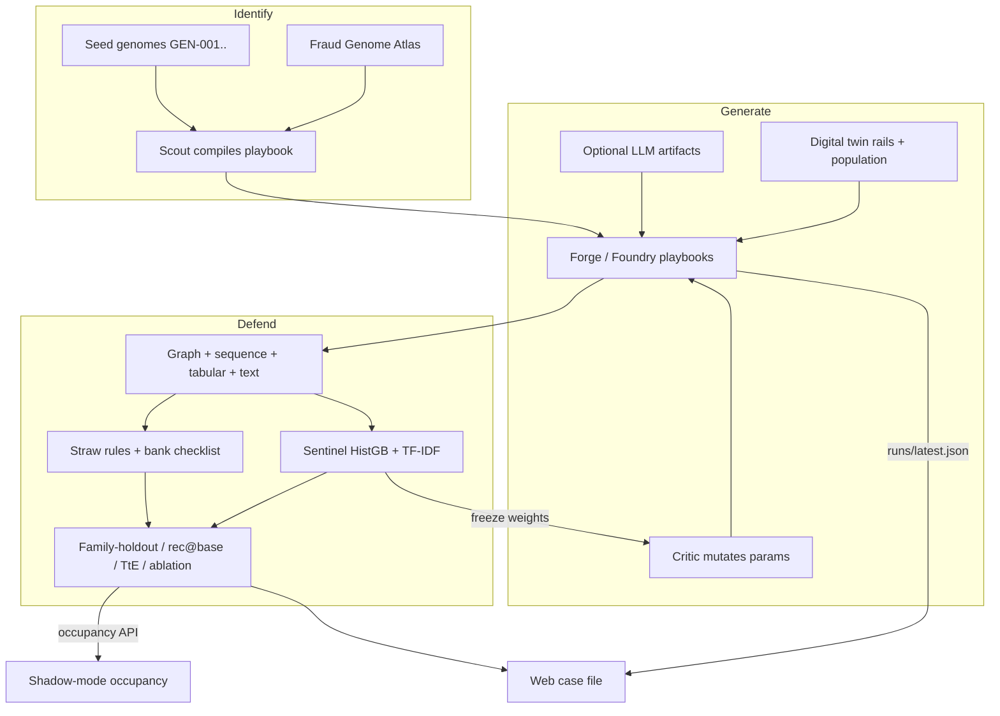
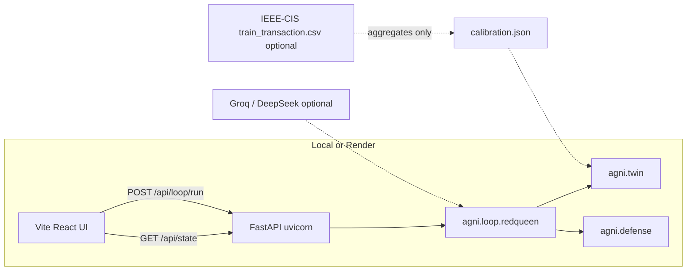

# AGNI — Fraud Wind Tunnel

**Mastercard Innovation Challenge 2026 · AI Defense Lab for Payment Security**

Identify novel GenAI payment-fraud vectors, generate them on a calibrated digital twin, and defend with a measured detector — in one closed loop.

GitHub: [Skrisps26/agni-fraud-wind-tunnel](https://github.com/Skrisps26/agni-fraud-wind-tunnel)

AGNI is a **lab wind tunnel + scoring protocol**. Sentinel (the classifier) is one occupant of the tunnel, not a claim of production Mastercard Decision Intelligence.

| Stage | What ships | Honest bound |
|--------|------------|--------------|
| **Identify** | Fraud Genome Atlas, 13+ compiled Foundry playbooks, Scout that *compiles* a new playbook (not a JSON clone), documented empty cells | Coverage and TTP distance, not “38 unique engines” |
| **Generate** | Digital twin (UPI / card / wire / wallet), IEEE-CIS amount/hour calibration (USD→INR), optional LLM artifacts, Critic mutation | IEEE-CIS ≠ live UPI/NPCI rails |
| **Defend** | Sentinel (HistGB + TF-IDF LR), straw rules + bank checklist, family-holdout / recall@base-rate / time-to-evade / ablation | Lab AUC is not the headline; rules are **not** Mastercard production |

---

## Architecture

Closed loop. Scout fills atlas holes. Forge executes playbooks on the twin. Sentinel scores. Critic mutates until a **frozen** model is stressed. Occupancy and honest eval sit outside the training path.



Runtime: Python loop + FastAPI; React UI is built into `web/dist` and served from the same process (one Docker image on Render).



---

## Requirements

- Python **3.11+**
- Node **20+** (UI build)
- Make
- Optional: [IEEE-CIS Fraud Detection](https://www.kaggle.com/c/ieee-fraud-detection) `train_transaction.csv` (Kaggle license; **do not commit** the CSV)
- Optional: Groq or DeepSeek API key for LLM-forged messages (fully offline without it)

---

## Reproduce (no API keys)

This is the path that should work from a clean clone. Seeded `runs/latest.json` powers the UI if you skip the loop.

```bash
git clone https://github.com/Skrisps26/agni-fraud-wind-tunnel.git
cd agni-fraud-wind-tunnel

make setup
make atlas
make eval-honest
make test
make loop ARGS='--generations 5'   # AGNI_LLM_PROVIDER=none by default
make ui-build
make api                           # http://127.0.0.1:8000
```

| Command | What it does |
|---------|----------------|
| `make setup` | `.venv` + `pip install -e ".[dev]"` |
| `make atlas` | Coverage matrix + documented holes |
| `make eval-honest` | Family holdout, recall at ~0.2% base rate, ablation, IsolationForest occupant |
| `make loop` | Red Queen generations → `runs/latest.json` |
| `make ui-build` | `web/` → `web/dist` |
| `make api` | FastAPI serves API **and** UI |
| `make test` | pytest |
| `make calibrate` | Fit twin to IEEE-CIS (after placing the CSV) |

Live UI while hacking: `make api` and `make ui` (Vite `http://127.0.0.1:5173`, proxies `/api`).

If port 8000 is taken: `fuser -k 8000/tcp` then `make api`.

### Optional: calibrate twin to real tickets

```bash
# After accepting IEEE-CIS rules on Kaggle:
cp /path/to/train_transaction.csv data/anchor/
make calibrate    # writes agni/twin/calibration.json (aggregates, no raw rows)
make twin         # alias
```

See [data/README.md](data/README.md). Cloud images must **not** contain the CSV.

### Optional: LLM enrichment

Copy [`.env.example`](.env.example) to `.env` (gitignored). Example Groq:

```
AGNI_LLM_PROVIDER=groq
AGNI_LLM_API_KEY=gsk_...
AGNI_LLM_MODEL=llama-3.1-8b-instant
```

`AGNI_LLM_PROVIDER=none` (default) uses deterministic templates. Probe with `make test-llm`.

---

## Repository layout

```
agni/
  genome/          Identify — schema, seed genomes, atlas
  agents/          Scout (compile playbook), Critic (mutate)
  foundry/         Generate — playbooks + sandbox compiler
  twin/            Population, rails (UPI pay/collect, card, wire…), calibrate
  defense/         Sentinel, features, straw rules
  eval/            Honest protocol (holdout, occupancy)
  loop/            Red Queen closed loop
  llm/             Optional OpenAI-compatible client + cache
  server/          FastAPI
web/               React + Vite case-file UI
scripts/           eval_honest, rebuild_demo_chains, test_llm
tests/
runs/latest.json   Seeded demo (first paint; no raw IEEE)
docs/              Writeup, shadow-mode, walkthrough outline
Dockerfile         UI build + Python API (Render)
render.yaml
```

---

## How the loop is implemented

### Identify

- Seed genomes: `agni/genome/seed/GEN-*.json` (executable vs catalog-only).
- Atlas: `agni/genome/atlas.py` — rails × surfaces × GenAI capabilities; empty cells are first-class output (`make atlas`, `GET /api/atlas`).
- Scout: `agni/agents/scout.py` — compiles a Foundry sandbox playbook for a hole; a genome that cannot execute is not counted as Identify.

### Generate

- Twin: `agni/twin/` — Zipf merchants, UPI pay/collect, target fraud rate, joint fidelity (KS + MMD on log amount and hour).
- Playbooks: `agni/foundry/playbooks/` — social, identity, agentic infra, support; Scout-compiled sandbox in `agni/foundry/sandbox.py`.
- Forge artifacts (optional LLM): `agni/llm/`.
- Critic: `agni/agents/critic.py` — mutates parameters against a **frozen** Sentinel.

### Defend

- Features: tabular + velocity + mule fan-in + sequence + message TF-IDF (`agni/defense/features.py`).
- Sentinel: HistGradientBoosting + text logistic fusion, conformal FPR floor (`agni/defense/model.py`). Default FPR budget **0.5%**.
- Baselines: velocity/amount straw rules and a labeled **non-Mastercard** bank checklist (`agni/defense/baseline.py`).
- Protocol: `agni/eval/harness.py` — families held out of gen-0 training (`mule_graph_ring`, `subscription_mandate_trap`, `npci_chatbot_phish`), recall at production-like base rate, graph/sequence/tabular ablation, IsolationForest as a second occupant.
- Time-to-evade: generations a frozen model lasts under Critic at the published FPR.

Headline numbers live in `runs/latest.json` (`protocol`, `tte_generations`, `fidelity_overall`, `atlas`). Lab in-generator AUC is **not** the claim.

---

## HTTP API

| Method | Path | Purpose |
|--------|------|---------|
| `GET` | `/health` | Render health check |
| `GET` | `/api/state` | Full demo state from `runs/latest.json` |
| `POST` | `/api/loop/run` | `{generations, seed?}` — cloud caps at 1 gen (`AGNI_CLOUD=1`) |
| `GET` | `/api/atlas` | Coverage matrix |
| `POST` | `/api/occupancy` | Score an external occupant (labels + scores, no PAN/VPA) |

UI is same-origin: `GET /` serves `web/dist`.

---

## Host (one service)

Do not split Netlify + API unless you add CORS and an API base URL. This repo is **one Docker web service**.

1. Push `main` (this README assumes GitHub above).
2. [Render](https://render.com) → New Web Service → Docker, blueprint [`render.yaml`](render.yaml).
3. Env: `AGNI_CLOUD=1`, `AGNI_LLM_PROVIDER=none` (add LLM keys later if needed).
4. Health check: `/health`. Do not upload `train_transaction.csv`.
5. Paste the public URL into [`SUBMISSION.md`](SUBMISSION.md).

Free dynos spin down; first request can take 30–60s. Seeded `runs/latest.json` is the judge-safe first paint.

Railway: same Dockerfile and env vars.

---

## Docs

| Doc | Role |
|-----|------|
| [docs/KAGGLE_WRITEUP.md](docs/KAGGLE_WRITEUP.md) | Criterion map for judges |
| [docs/SHADOW_MODE.md](docs/SHADOW_MODE.md) | Occupancy / CISO constraints |
| [docs/walkthrough-outline.md](docs/walkthrough-outline.md) | Demo script |
| [SUBMISSION.md](SUBMISSION.md) | Live URL placeholder |
| [PRODUCT.md](PRODUCT.md) | Product framing |
| [web/DESIGN.md](web/DESIGN.md) | UI world |

---

## Responsible use

- Synthetic identities only. Playbooks are **TTP-level research artifacts**, not exploit kits.
- IEEE-CIS raw files stay off git and off the cloud image; only `calibration.json` aggregates are committed.
- Straw rules and the bank checklist are **not** Mastercard production rules.
- No claim of live issuer 3DS, NPCI microdata, or Decision Intelligence deployment.

License: [MIT](LICENSE).
