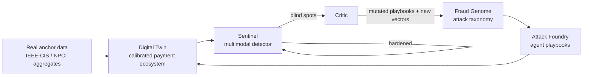
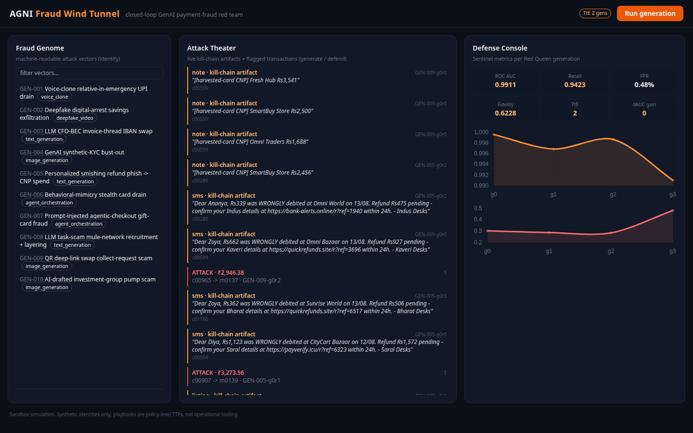

# AGNI - Fraud Wind Tunnel

Closed-loop adversarial AI system for GenAI-powered payment fraud:
**identify** emerging attack vectors, **generate** high-fidelity simulations at
scale, **defend** with a hardened detector - and let each pillar feed the next.





## Why a wind tunnel

Static fraud models decay: attackers adapt. AGNI measures that decay and fights
it. Each Red Queen generation executes every attack vector against a digital
twin of Indian retail payments, retrains Sentinel on the labeled stream, then
evaluates the *previous* defender frozen against the new attacks. Two metrics
fall out that static submissions cannot produce:

- **Time-to-Evade (TtE)** - consecutive generations a frozen defender survives
  (AUC >= threshold) before the evolving attacks evade it.
- **Loop Gain** - dAUC delivered by each retrain cycle.

Attack realism is scored by a **Fidelity Judge**: KS-similarity of amount and
hour distributions, velocity plausibility, artifact diversity - measured
against a **real public dataset**, not against ourselves (see below).

## Real-data anchoring (no hand-waved distributions)

The twin's statistical skeleton is *fitted*, not guessed:

1. Drop `train_transaction.csv` ([IEEE-CIS/Vesta via Kaggle](https://www.kaggle.com/c/ieee-fraud-detection))
   into `data/anchor/` (see `data/README.md`).
2. `make calibrate` -> fits amount log-normal params, hour-of-day shape,
   per-product ticket sizes; writes derived stats to `agni/twin/calibration.json`
   (raw data never committed).
3. The loop auto-detects calibration: population ticket sizes/hour profiles come
   from fitted parameters, and the Fidelity Judge scores attacks against the
   **real marginals**. Offline fallback (twin-internal reference) keeps
   everything runnable without any download.

## Quickstart

```bash
make setup          # venv + pip install -e ".[dev]" (uses uv when available)
make calibrate      # optional: fit real-anchor statistics
make loop           # 5 generations, writes runs/latest.json
make api            # dashboard at http://localhost:8000
make test
```

CLI equivalents: `python -m agni.loop.redqueen --generations 5 --seed 7`.
Everything runs offline and deterministically; no API keys required.

## Layout

```
agni/
  config.py                 env-driven configuration
  genome/                   Pillar 1 - Identify
    schema.py               AttackGenome model + evolution/critic helpers
    seed/*.json             10 curated vectors (voice-clone UPI drain, deepfake
                            digital arrest, CFO-BEC IBAN swap, synthetic-KYC
                            bust-out, personalized smishing, behavioral mimicry,
                            agentic prompt injection, task-scam mule network,
                            QR deep-link swap, AI investment group)
  twin/                     Digital twin
    population.py           consumers/merchants/devices/banks/mule pools;
                            log-normal tickets, circadian profiles; consumes
                            real-anchor calibration when present
    rails.py                ledger, artifacts, background legit traffic
    calibrate.py            fit marginals from IEEE-CIS anchor; judge reference
  foundry/                  Pillar 2 - Generate
    base.py                 Playbook ABC, registry, mutation contract
    playbooks/social.py     voice_relative_upi, digital_arrest, cfo_bec_wire,
                            personalized_smishing
    playbooks/identity.py   synthetic_kyc, behavioral_mimicry
    playbooks/agentic_infra.py  agent_prompt_injection, mule_recruitment
    judge.py                Fidelity Judge (KS vs real anchor or internal ref)
  defense/                  Pillar 3 - Defend
    features.py             velocity windows, expanding z-score, dst fan-in /
                            forwarding rates, device novelty, risk flags
    model.py                HistGradientBoosting + TF-IDF text head fusion;
                            FPR-budgeted threshold policy
  loop/redqueen.py          the closed loop + TtE / Loop Gain + CLI
  server/main.py            FastAPI backend for the prototype UI
web/index.html              three-pane dashboard (Genome Browser /
                            Attack Theater / Defense Console)
tests/                      smoke + calibration tests incl. mini end-to-end loop
docs/walkthrough-outline.md source outline for the submission .docx
```

## Configuration

All optional (see `.env.example`): `AGNI_SEED`, `AGNI_CONSUMERS`, `AGNI_DAYS`,
`AGNI_RUNS_PER_GENOME`, `AGNI_FPR_BUDGET` (default 0.005),
`AGNI_TTE_THRESHOLD` (default AUC 0.90), `AGNI_USD_INR` (anchor fx),
plus optional LLM enrichment via `AGNI_LLM_PROVIDER/API_KEY/MODEL`.

## Safety and responsible use

- Fully sandboxed simulation; **synthetic identities only**, no real PII.
- Raw anchor CSVs are license-restricted and gitignored; only derived aggregate
  statistics are committed.
- Playbooks encode TTP-level strategy and template content - they are detection
  research artifacts, not operational scam tooling.
- No cloning of real individuals' voices or likenesses; transcripts are clearly
  synthetic template output.
- Intended use: training/stress-testing defenses, per the challenge brief.

## Roadmap to submission

- [x] Genome schema + 10 seed vectors (expand library toward ~40)
- [x] Digital twin with realistic distributions + real-anchor calibration path
- [x] 8 executable playbooks + fidelity judging vs real marginals
- [x] Fusion detector + FPR-budgeted thresholds
- [x] Red Queen loop with TtE / Loop Gain
- [x] Web prototype + API
- [ ] Feature-aware mutation so evasion dynamics are visible (P0)
- [ ] LLM-enriched playbook text + critic proposals (optional module)
- [ ] Expand genome library via critic mining; GNN head for mule rings
- [ ] SHAP alert explanations in Defense Console; walkthrough docx

## License

MIT.
